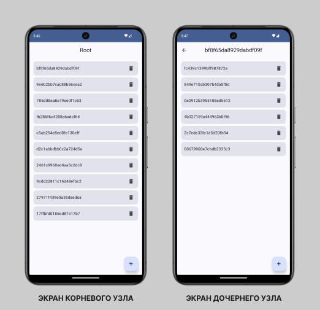

# Тестовое задание для DeNet

Приложение представляет собой дерево из узлов (Node) имеющих неограниченное количеством потомков.

Приложение многомодульное, написано с архитектурой MVI / Clean Architecture.

### Стек:
- Coroutines / Flow
- ViewModel
- Compose UI
- Room
- Dagger / Hilt

## Скриншоты

